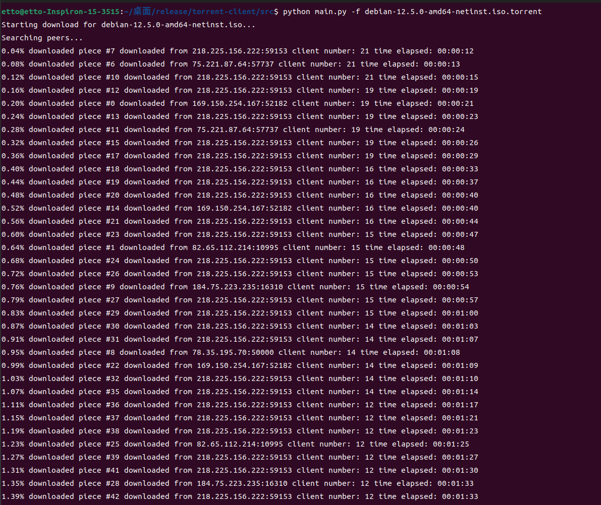

# a simple bittorrent client
## description
this is a simple bittorent client,only support tcp connection to peers.

### **screenshot:**
<div>
</img>
</div>

## usage

```
cd torrent-client
python main.py -v 1 -f debian-12.5.0-amd64-netinst.iso.torrent
```
>Note: no extra requirement needed,use python native library